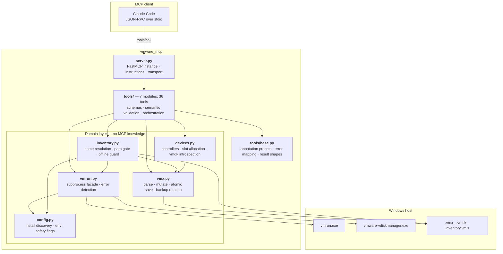
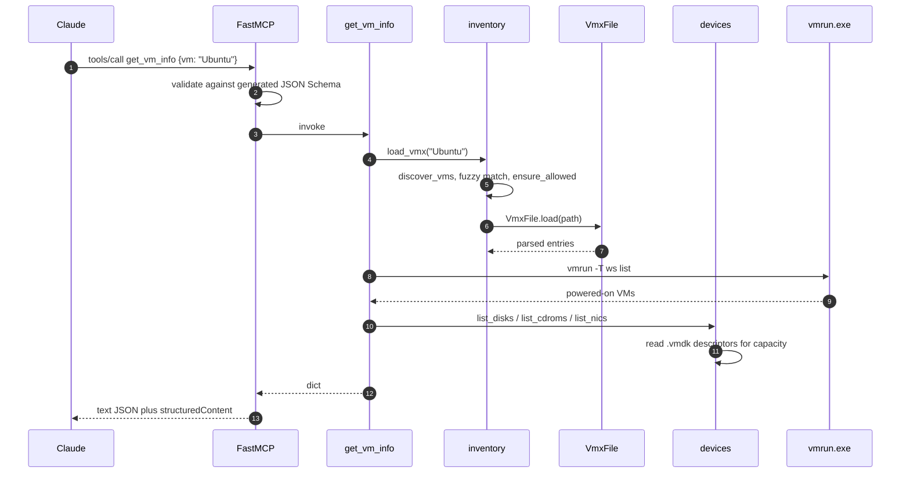
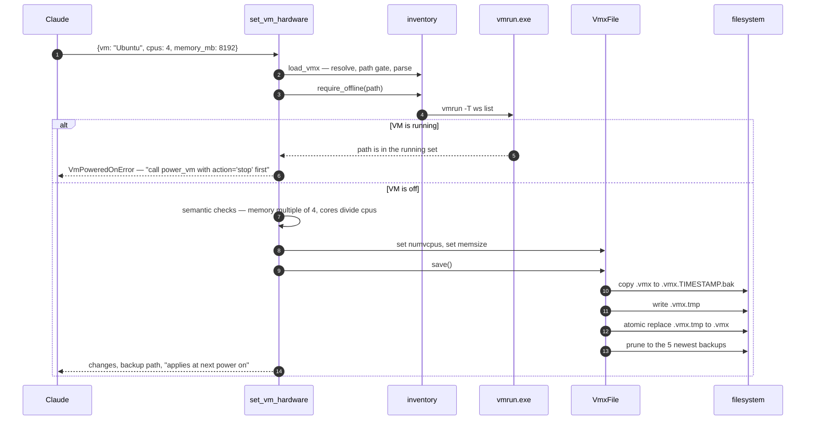
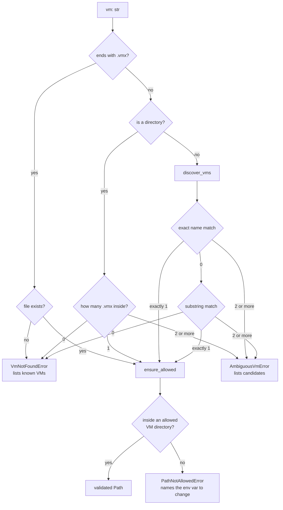

# Architecture

How `vmware-mcp-server` is put together, and why. For installation and tool usage, see
the [README](../README.md).

---

## 1. What the server is

A **local stdio MCP server** that gives an MCP client (Claude Code) control over VMware
Workstation Pro on a Windows host. It exposes **36 tools** across seven domains: discovery,
power, snapshots, virtual hardware, networking, storage, VM lifecycle, and guest-OS
operations.

There is no daemon, no network listener, and no database. The server is a short-lived
process that the MCP client spawns, speaks JSON-RPC to over stdin/stdout, and kills. All
state lives where VMware already keeps it — in `.vmx` files, `.vmdk` files, and VMware's
own `inventory.vmls`.

### Why local stdio

| Constraint | Consequence |
|---|---|
| Must drive `vmrun.exe` and edit files on the user's disk | Rules out a remote HTTP server |
| Single operator on their own workstation | No auth, no multi-tenancy, no session state |
| Python is easy to install and already needed for the tooling | No need for MCPB runtime bundling yet |

The upgrade path, if this is ever distributed to people without Python, is MCPB — bundling
the interpreter. Nothing in the design blocks that: the transport is chosen in one line
(`server.py::main`).

### Two backends, one surface

VMware exposes no single complete API for Workstation, so the server uses whichever
mechanism actually works per operation and hides the seam from the caller:

| Mechanism | Used for | Why not the others |
|---|---|---|
| `vmrun.exe` | Power, snapshots, clone, delete, guest ops, host networks | Runtime actions with no file representation |
| Direct `.vmx` editing | CPU, RAM, firmware, NICs, disks, display, options | `vmrun` cannot set any of these |
| `vmware-vdiskmanager.exe` | Create, expand, compact, defragment `.vmdk` | Disk geometry is not stored in the `.vmx` |

A third option, the `vmrest` REST API, was rejected: it needs the user to run `vmrest -C`
to set credentials, needs a background daemon, and still cannot reach most hardware
settings.

---

## 2. Layers



The rule that keeps this honest: **the domain layer never imports FastMCP.** `vmx.py`,
`devices.py`, `inventory.py`, `vmrun.py`, and `config.py` know nothing about MCP, tools, or
JSON schemas. They raise plain `VmwareMcpError` subclasses. Only `tools/` knows it is
serving an LLM — that is where schemas, descriptions, and `ToolError` translation live.

That boundary is what makes the domain layer testable without a running MCP session, and
what would let the same core be re-hosted behind a CLI or a REST service.

---

## 3. Module map

| Module | Lines | Responsibility |
|---|---:|---|
| `server.py` | 57 | Builds the `FastMCP` instance, sets server instructions, starts stdio |
| `config.py` | 185 | Locates VMware (env → registry → Program Files), reads env flags, computes allowed VM directories. Frozen dataclass, built once via `lru_cache` |
| `errors.py` | 50 | Ten typed errors, each mapping to a distinct recovery hint |
| `vmx.py` | 292 | Order-preserving `.vmx` reader/writer with encoding detection, atomic save, backup rotation |
| `vmrun.py` | 154 | `VmRun` callable + `vdiskmanager()`. Builds argv, injects guest credentials, decodes output, decides success |
| `inventory.py` | 277 | VM discovery (library + directory scan), fuzzy name resolution, the allowed-path gate, the powered-off guard |
| `devices.py` | 213 | Interprets the device half of a `.vmx`: controllers, disks, CD-ROMs, NICs, free-slot allocation, `.vmdk` capacity |
| `tools/base.py` | 110 | Annotation presets, `tool_errors` decorator, destructive gate, shared result and summary builders |
| `tools/discovery.py` | 240 | 8 read-only tools |
| `tools/power.py` | 195 | 5 power and snapshot tools |
| `tools/hardware.py` | 338 | 4 tools for CPU/RAM/options and the raw `.vmx` escape hatch |
| `tools/network.py` | 329 | 4 NIC and host-NAT tools |
| `tools/disks.py` | 447 | 6 disk and CD-ROM tools |
| `tools/lifecycle.py` | 465 | 3 tools: create, clone, delete |
| `tools/guest.py` | 394 | 6 guest-OS tools via VMware Tools |

Tool modules follow a uniform contract — each exposes `register(mcp)`, and
`tools/__init__.py` holds the ordered `MODULES` tuple. Adding a domain means adding a file
and one tuple entry; nothing else changes.

---

## 4. Request lifecycle

### Read path



### Write path

The write path adds three gates the read path does not have: the **offline guard**,
**semantic validation**, and **atomic save with backup**.



Ordering matters and is deliberate: **resolve → gate → guard → validate → mutate → save.**
Every check that can fail cheaply happens before anything touches the disk, so a rejected
call leaves no partial state and no stray backup file.

---

## 5. Core subsystems

### 5.1 VM resolution

Callers should not have to know where VMware put a VM. Every tool's `vm` parameter accepts
a display name, an unambiguous fragment of one, a folder, or a full `.vmx` path.
`resolve_vmx()` is the single funnel for that parameter, and it is where the VM-directory
gate sits.

**It only covers the `vm` parameter.** Any tool taking a *separate* host path —
`add_disk(existing_vmdk=…)`, `create_vm(directory=…)`, `guest_copy_file(host_path=…)` —
must gate that argument itself. An earlier version of this document claimed there was "no
way to reach a path without passing through" the funnel; that was true of `.vmx` paths and
false of host-path arguments, and the gap it hid is described in §5.2.



`discover_vms()` merges two sources and de-duplicates by normalised path:

1. **`inventory.vmls`** — VMware's own library sidebar, giving true display names and
   favourite flags.
2. **A directory scan** of the allowed roots, depth-capped at `MAX_SCAN_DEPTH = 4`, which
   finds VMs that were never opened in the UI.

Library entries outside the allowed directories are dropped before merging. Surfacing a VM
that every other tool would then refuse to touch only manufactures false ambiguity when
resolving names — this was a real bug caught by the test suite.

### 5.2 The path gate

`VMWARE_MCP_VM_DIRS` is the security boundary, not a convenience setting. `ensure_allowed()`
resolves the candidate path (following symlinks and `..`) and requires it to be under one
of the configured roots. It guards `.vmx` reads, `.vmx` writes, `.vmdk` creation, `.vmdk`
deletion, and the parent directory of new VMs and clones.

Defaults cover VMware's usual locations — `%USERPROFILE%\Documents\Virtual Machines`, the
OneDrive-redirected equivalent, and `%PUBLIC%\Documents\Shared Virtual Machines`.
`VMWARE_MCP_ALLOW_ANY_PATH=1` disables the check for users who keep VMs on a scratch drive.

The failure message always names the offending path, lists the configured roots, and states
the two env vars that would allow it — a dead end becomes a next step.

#### The second gate: host/guest file traffic

`ensure_host_io_allowed()` guards the host paths in `guest_copy_file` and
`set_shared_folder`, against a **separate** allow-list, `VMWARE_MCP_HOST_IO_DIRS`, which is
**empty by default** — so those tools are inert until an operator nominates an exchange
folder.

Three deliberate differences from the VM gate, each because the trust decision is different:

- **Not `VMWARE_MCP_VM_DIRS`.** A guest allowed to write into a VM directory could
  overwrite the `.vmx` this server reads back, or another VM's disks.
- **Not satisfied by `VMWARE_MCP_ALLOW_ANY_PATH`.** That flag is about where the operator
  keeps VMs; it is not consent to hand an untrusted guest a path on the host.
- **Empty by default rather than gated on `VMWARE_MCP_ALLOW_DESTRUCTIVE`.** A per-directory
  opt-in is finer grained than a single coarse flag, and it avoids the trap where enabling
  destructive VM operations silently also enables host file I/O.

The check runs *before* the powered-on check, so it is unconditional and the caller is not
made to boot a VM only to be refused afterwards.

This gate was missing entirely in the first version: the whole of `guest.py` had zero calls
to either gate while `disks.py` and `lifecycle.py` had five. The gate logic was never
broken — the module simply never called it, which is why the tests below assert on the
*call sites*, not only on behaviour.

### 5.3 The `.vmx` read-modify-write cycle

A `.vmx` is a flat `key = "value"` store, but naive rewriting causes real damage: VMware's
parser is case-insensitive about keys, files may be UTF-8 or windows-1252 (declared by the
file's own `.encoding` key), and reordering produces unreadable diffs.

`VmxFile` handles all four concerns:

- **Order preservation.** Entries are stored as a list, not a dict. Comments and blank
  lines are kept verbatim as opaque entries. Setting an existing key mutates it in place;
  only genuinely new keys are appended.
- **Case-insensitive lookup, case-preserving write.** `get("MEMSIZE")` finds `memsize`, and
  writing through the uppercase spelling leaves the original casing on disk.
- **Encoding round-trip.** The `.encoding` declaration is sniffed from the raw bytes before
  decoding, then reused on save. CRLF versus LF is likewise detected and preserved.
- **Atomic save.** Writes go to a sibling `.vmx.tmp` and land via `Path.replace()`, so a
  crash mid-write cannot leave a truncated `.vmx` that VMware would refuse to open.
- **Unrepresentable input is refused.** The format has no escape sequence: a value runs
  from the opening quote to the end of the line. So a `"`, `\r`, or `\n` in a value cannot
  be encoded — it truncates the value and turns the remainder into *additional settings*.
  `set()` rejects those characters in both key and value (and `=` or a leading `#` in a
  key). Validating in the serializer rather than per tool is what makes it hold: a single
  `set_vm_options(annotation=…)` with an embedded newline previously wrote nine extra
  settings, including `sharedFolder0.hostPath = "C:\"`, straight past the `PROTECTED_KEYS`
  filter that `set_vm_config` applies. Any tool added later is now covered without having
  to remember to sanitise its own inputs.
- **Duplicate keys are treated as corruption.** Probing Workstation 17.6 on the host
  settled what the format actually does: a `.vmx` containing the same key twice **cannot be
  opened at all** — an otherwise identical control file opened fine, while duplicating
  either `memsize` or `annotation` produced *"Cannot read the virtual machine configuration
  file"*. So a repeat is not an override to resolve, it is a broken file. `get()` scans
  backwards to agree with `as_dict()` and `set()`; `set()` writes the last occurrence and
  deletes earlier ones, so touching a key repairs it; `save()` refuses to persist a file
  that still has duplicates, naming them; and `get_vm_info` / `get_vm_config` report them
  so a tampered file is visible rather than silently flattened. `unset_vm_config` removes
  every occurrence, which makes unset-then-set the repair path.

Every save also copies the previous file to `<name>.vmx.<timestamp>.bak` and prunes to the
five newest (`MAX_BACKUPS`). Backups are the undo for settings changes; snapshots are the
undo for everything else. `delete_vm` cleans up its own backups, since `vmrun deleteVM`
only removes files VMware itself recognises.

### 5.4 Invoking VMware's binaries

`vmrun` is awkward to automate: it prints `Error: ...` on **stdout**, sometimes while still
exiting 0. `_run()` therefore treats a command as failed if *either* the exit code is
non-zero *or* any output line begins with a known error prefix.

`VmRun.__call__` also handles the parts every call needs:

- prepends `-T ws` (the Workstation host type)
- injects `-gu` / `-gp` for the fifteen subcommands in `GUEST_COMMANDS`, falling back to
  `VMWARE_MCP_GUEST_USER` / `VMWARE_MCP_GUEST_PASSWORD`, and failing with an explanatory
  message when neither is available
- decodes output as UTF-8, then cp1252
- converts a timeout into an error that names `VMWARE_MCP_TIMEOUT`

Arguments are always passed as a list with a fixed executable and no shell, so VM names
containing spaces, quotes, or `&` cannot alter the command.

### 5.5 The device model

`devices.py` reconstructs a VM's hardware from flat keys like `scsi0:1.fileName`. It groups
keys by `controller:unit` node, classifies each node as disk / CD-ROM / other (using
`deviceType` when present, falling back to the file extension — VMware omits `deviceType`
for SCSI disks), and knows each controller family's limits:

| Family | Max controllers | Units per controller | Reserved |
|---|---:|---|---|
| `scsi` | 4 | 0–15 | unit 7 is the controller itself |
| `sata` | 4 | 0–29 | — |
| `nvme` | 4 | 0–14 | — |
| `ide` | 2 | 0–1 | — |

`next_free_node()` fills controllers the VM already has before declaring a new one, and
only then moves to `scsi1`, `scsi2`, and so on. The first implementation skipped absent
controllers entirely and failed once `scsi0` was full — also caught by the tests.

Disk capacity comes from parsing extent lines out of the `.vmdk` descriptor
(`RW <sectors> SPARSE ...`), which works for both text descriptors and the descriptor
embedded in a sparse binary header. Anything unreadable reports `null` rather than guessing.

### 5.6 The safety model

Six independent layers, each catching a different failure:

| Layer | Mechanism | Prevents |
|---|---|---|
| **VM path gate** | `ensure_allowed()` against `VMWARE_MCP_VM_DIRS` | Touching VM files outside the VM tree |
| **Host-I/O gate** | `ensure_host_io_allowed()` against `VMWARE_MCP_HOST_IO_DIRS` | An untrusted guest reading or writing arbitrary host paths |
| **Serializer validation** | `VmxFile.set()` refuses `"`, `\r`, `\n`; `save()` refuses duplicate keys | Free-text parameters injecting extra `.vmx` settings, and writing a file VMware cannot open |
| **Offline guard** | `require_offline()` checks `vmrun list` | Edits VMware silently discards on a running VM |
| **Destructive gate** | `require_destructive_enabled()` reads `VMWARE_MCP_ALLOW_DESTRUCTIVE` | Irreversible deletes on a default install |
| **Tool annotations** | `READ_ONLY` / `MUTATING` / `DESTRUCTIVE` presets | The host auto-approving something dangerous |

The annotation presets in `tools/base.py` exist so blast radius is declared once, uniformly,
rather than hand-written per tool:

```python
READ_ONLY   = {"readOnlyHint": True,  "idempotentHint": True,   "openWorldHint": False}
MUTATING    = {"readOnlyHint": False, "destructiveHint": False, "openWorldHint": False}
DESTRUCTIVE = {"readOnlyHint": False, "destructiveHint": True,  "openWorldHint": False}
```

`openWorldHint` is `False` everywhere: this server talks only to the local machine.

`delete_vm` adds a fifth check of its own — a `confirm_name` argument that must match the
*resolved* VM. Fuzzy name matching is convenient for reads and unacceptable for deletion,
so the tool makes the caller restate what the fuzzy match actually landed on.

---

## 6. Tool surface

36 tools, one per action. That is above the roughly 30 where the search-and-execute pattern
normally wins, and the trade-off was made deliberately: this is a small, closed,
well-known domain where wrong calls are expensive. A model that can read
`resize_disk(vm, node, new_size_gb)` in the tool list will not try to shrink a disk; one
that has to discover the tool through a search call might.

| Module | Read-only | Mutating | Destructive | Tools |
|---|---:|---:|---:|---|
| `discovery` | 8 | — | — | `list_vms`, `get_vm_info`, `get_vm_config`, `list_host_networks`, `list_port_forwardings`, `get_vm_ip`, `check_vmware_tools`, `get_server_config` |
| `power` | 1 | 2 | 2 | `power_vm`, `list_snapshots`, `create_snapshot`, `revert_snapshot`, `delete_snapshot` |
| `hardware` | — | 4 | — | `set_vm_hardware`, `set_vm_options`, `set_vm_config`, `unset_vm_config` |
| `network` | — | 3 | 1 | `set_network_adapter`, `add_network_adapter`, `remove_network_adapter`, `manage_port_forwarding` |
| `disks` | — | 5 | 1 | `add_disk`, `detach_disk`, `resize_disk`, `optimize_disk`, `attach_iso`, `detach_iso` |
| `lifecycle` | — | 2 | 1 | `create_vm`, `clone_vm`, `delete_vm` |
| `guest` | 1 | 4 | 1 | `guest_run_command`, `guest_copy_file`, `guest_list_processes`, `guest_kill_process`, `set_shared_folder`, `capture_screen` |
| **Total** | **10** | **20** | **6** | **36** |

### Schema conventions

- Every parameter carries a `description`, and every constraint expressible in the schema is
  expressed there (`ge`/`le`, `Literal`, `min_length`) so bad calls fail at validation
  rather than at `vmrun`.
- Optional settings default to `None` meaning *leave untouched*, never a substituted value.
  `set_vm_hardware` called with only `memory_mb` changes only memory.
- Descriptions state what a tool does **not** do, and name the sibling that does — for
  example `add_disk` points at `resize_disk` for growing a disk that already exists.
- Mutation results return `{vm, vmx_path, changes, backup, note}` from `saved_result()`, so
  the caller always learns what changed and where the rollback file is.

### Server instructions

`server.py` ships an `instructions` block with the two facts that shape almost every
workflow and are not visible from any single tool schema: hardware edits need the VM
powered off, and guest tools need it powered on with VMware Tools. Stating them once at the
server level avoids repeating them across 36 descriptions.

---

## 7. Error handling

Domain code raises typed errors; `tools/base.py::tool_errors` wraps every tool and converts
them into FastMCP `ToolError`, which is the only exception class whose message is guaranteed
to reach the model. Anything else is masked as a generic internal error — so an unexpected
crash never leaks a traceback or a filesystem path into the conversation.

| Error | Raised when | The message tells the caller |
|---|---|---|
| `VmwareNotFoundError` | `vmrun.exe` cannot be located | To set `VMWARE_MCP_INSTALL_DIR` |
| `VmNotFoundError` | No VM matched | The list of known VMs |
| `AmbiguousVmError` | Several VMs matched | The candidates, with paths |
| `PathNotAllowedError` | VM path outside the allowed roots | The roots, and the env var to change |
| `HostIoNotAllowedError` | Host path for guest file I/O not approved | To set `VMWARE_MCP_HOST_IO_DIRS` to an exchange folder |
| `InvalidVmxValueError` | Key or value cannot be encoded in `.vmx` | Which character is the problem, and to remove it |
| `DuplicateVmxKeyError` | The `.vmx` defines a key twice | Which key, its conflicting values, and the unset-then-set repair |
| `VmPoweredOnError` | Offline-only edit on a running VM | To call `power_vm` with `action='stop'` |
| `ToolExecutionError` | `vmrun` or `vdiskmanager` failed or timed out | The tool's own error line, or `VMWARE_MCP_TIMEOUT` |
| `DestructiveOpDisabledError` | Destructive op while the gate is closed | Which env var unlocks it |
| `VmwareMcpError` | Semantic validation failed | The valid values — for example the divisors of `cpus` |

The convention is that **an error message is a next step, not a diagnosis.** "memory_mb=4095
is not a multiple of 4. VMware rejects other values; try 4092" lets the model recover in one
turn.

---

## 8. Configuration and startup

`Config` is a frozen dataclass built once per process behind `lru_cache`. Environment is
read in exactly one place, which keeps tools free of ambient `os.environ` lookups and makes
tests trivial — they construct a `Config` pointed at a temp directory and pass it in.

```
main()
 ├─ logging → stderr            # stdout belongs to the stdio transport
 ├─ build_server()
 │   ├─ FastMCP(name, version, instructions)
 │   └─ register_all(mcp)       # 7 modules × register(mcp)
 └─ mcp.run()                   # stdio transport
```

Install discovery order: `VMWARE_MCP_INSTALL_DIR` → Windows registry (`VMware, Inc.` keys,
both 32- and 64-bit views) → the standard `Program Files` paths. Failure raises
`VmwareNotFoundError` at first use rather than at import, so the server still starts and
`get_server_config` can report what went wrong.

Logging goes to **stderr**, always. On a stdio transport, anything written to stdout
corrupts the JSON-RPC stream.

---

## 9. Testing

32 tests cover the layer that carries the risk — parsing and path handling — without
touching real VMs or requiring VMware to be installed. `tests/conftest.py` provides a
`Config` pinned to a temp tree and a `make_vm()` helper that writes a minimal `.vmx`.

| File | Covers |
|---|---|
| `test_vmx.py` | Case-insensitive lookup, order preservation, comment survival, TRUE/FALSE rendering, cp1252 round-trip, CRLF preservation, atomic save, backup rotation, rejection of unrepresentable keys and values |
| `test_inventory.py` | Exact, case-insensitive, and substring resolution; ambiguity reporting; folder and path forms; the allowed-path gate and its override |
| `test_devices.py` | Disk versus CD-ROM classification, NIC listing, free-slot allocation across full controllers, controller auto-creation |
| `test_host_io_gate.py` | The host-I/O gate: closed by default, traversal, prefix-sharing siblings, non-transfer of VM-dir and `ALLOW_ANY_PATH` permissions, and an AST assertion that both guest tools still call it |
| `test_capture_screen.py` | AST assertions that `capture_screen` is not annotated read-only and still gates, suffix-checks, and refuses to overwrite its output path |

Two genuine bugs were found by these tests rather than by inspection: `next_free_node()`
refusing to create a second controller, and `discover_vms()` leaking out-of-tree library
entries. A third — swapped `NAME` and `TYPE` columns in `list_host_networks` — was found by
diffing parsed output against real `vmrun` output, which is why that tool still returns the
raw text alongside the parsed form.

Three of the security tests assert on **call sites via AST** rather than on behaviour. That
is deliberate: the defects they cover were not broken checks but *missing* ones — a whole
module never calling a gate, and a tool carrying the wrong annotation. A behavioural test
passes happily when the call is deleted again.

What the suite deliberately does **not** cover: `vmrun` invocation and the tool layer
itself. Both are thin, and mocking `vmrun` would mostly assert that the mock was called.
They are verified instead by an end-to-end run against real VMware in a scratch directory —
create, configure, add disk, snapshot, resize, clone, delete — plus the error paths.

---

## 10. Adding a tool

1. Pick the module matching the domain, or add one and append it to `MODULES` in
   `tools/__init__.py`.
2. Inside `register(mcp)`, write the function with `@mcp.tool(...)` outermost and
   `@tool_errors` innermost — decorator order matters, since FastMCP must see the
   already-wrapped function.
3. Choose an annotation preset. If the tool destroys data, also call
   `require_destructive_enabled()`.
4. Resolve the VM through `load_vmx()` (when the `.vmx` is needed) or `resolve_vmx()` (when
   only the path is). Never build a path by hand — that bypasses the gate.
5. For `.vmx` edits, call `require_offline()` before validating, and return
   `saved_result()`.
6. Write the docstring as the contract: what it does, what it returns, what it does not do,
   and which sibling tool covers that instead.

```python
@mcp.tool(title="...", annotations=MUTATING, tags={"vmware", "config"})
@tool_errors
def set_something(
    vm: Annotated[str, Field(description="VM display name, folder, or .vmx path.")],
    value: Annotated[int | None, Field(description="...", ge=1, le=64)] = None,
) -> dict:
    """One-line summary.

    What it returns, and what it does NOT do.
    """
    vmx = load_vmx(vm)
    require_offline(vmx.path, "Editing something")
    ...
    return saved_result(vmx, changes, vmx.save())
```

---

## 11. Trade-offs and limits

**Accepted deliberately**

- *36 tools instead of search-and-execute.* Costs roughly 4–5k tokens of context per turn,
  buys direct discoverability in a domain where a wrong call can destroy a VM.
- *Editing `.vmx` directly.* VMware offers no supported API for most of these settings. The
  risk is mitigated by the offline guard, atomic writes, and backups — not eliminated.
- *No mocking of `vmrun` in the unit suite.* Keeps tests fast and honest; real behaviour is
  covered end-to-end instead.
- *Fuzzy VM name matching.* Convenient and occasionally ambiguous. Ambiguity is always an
  error listing candidates, never a silent guess, and `delete_vm` demands confirmation.

**Inherent to VMware**

- **No vTPM.** Workstation requires full VM encryption for a virtual TPM, which this server
  does not manage. Windows 11 installs need the TPM check bypassed, or a vTPM added from
  the UI.
- **Disks only grow.** A `.vmdk` cannot shrink, and expanding a snapshot chain is refused —
  `resize_disk` checks for both and explains why.
- **No guest exit codes.** `vmrun` does not surface them, so `guest_run_command` redirects
  stdout and stderr to a temp file inside the guest and copies it back. Success has to be
  judged from the output text.
- **Host networking may need elevation.** `manage_port_forwarding` changes host-wide VMware
  state and can raise a UAC prompt the server cannot answer.
- **`vmrun deleteVM` leaves foreign files.** Anything VMware does not own stays behind; the
  tool reports the leftovers rather than deleting files it did not create.

**Not implemented**

Encrypted VMs (the `-vp` passphrase flag), OVF import/export via `ovftool`, USB device
passthrough, and team/multi-VM operations. Each would be an additive tool module; none
would change the architecture above.
